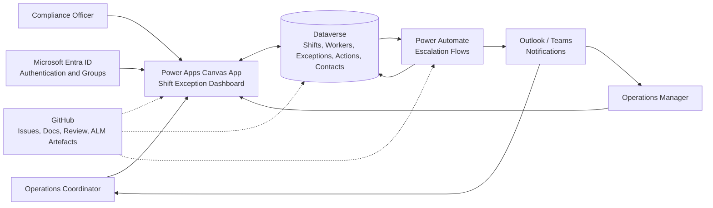

# NHS Professionals Shift Exception Management Demo

This repository demonstrates how GitHub Copilot and GitHub planning artefacts can support Power Platform delivery for a realistic NHS Professionals workforce operations scenario. The solution is a demo design for a Bank Shift Exception Management App, not a production deployment package or an approved NHS Professionals operating model.

## Functional Overview

Operations coordinators need a clear way to identify, triage, and escalate bank shift exceptions before they create operational risk. The app focuses on operational workforce coordination only and avoids patient clinical data, real staff records, and clinical decision-making.

The solution supports these functional needs:

- Show open and in-progress shift exceptions in a triage dashboard.
- Filter exceptions by trust, ward, priority, status, and exception type.
- Highlight shifts starting soon so coordinators can focus on time-critical work.
- Show related shift context, staffing gap, worker readiness, compliance status, and escalation status.
- Allow coordinators and compliance officers to record actions, notes, status changes, and resolution details.
- Escalate unresolved Critical and High exceptions after configured time thresholds.
- Maintain an auditable record of notifications, escalations, skipped actions, failures, and user updates.
- Separate coordinator, compliance officer, and manager access through Dataverse security roles.

## Target Users

| User | Primary Need |
| --- | --- |
| Operations Coordinator | Monitor urgent exceptions, triage the queue, contact workers, and record actions. |
| Compliance Officer | Review compliance blockers with enough context to decide the next operational step. |
| Operations Manager | Track escalated exceptions, review audit evidence, and confirm operational follow-up. |
| Product Manager | Convert the scenario into GitHub Issues that capture user value and acceptance criteria. |

## Technical Design

The target architecture uses a Power Apps canvas app backed by Dataverse, with Power Automate handling escalation workflows and GitHub managing source control, documentation, review, and backlog artefacts.

| Component | Role In The Solution |
| --- | --- |
| Power Apps canvas app | Desktop/tablet triage interface for filtering, reviewing, updating, escalating, and resolving shift exceptions. |
| Dataverse | Structured data store for shifts, workers, exceptions, exception actions, and trust contacts, with relationships, choices, auditing, and role-based security. |
| Power Fx | App logic for filters, risk scoring, worker readiness validation, state handling, empty states, and save/error feedback. |
| Power Automate | Cloud flows that identify unresolved Critical and High exceptions, send coordinator notifications, recheck after configured delays, escalate to trust contacts, and create Exception Action records. |
| Microsoft Entra ID | Authentication and group-based access assignment for app sharing and Dataverse security roles. |
| Outlook and Teams connectors | Notification channels for coordinator alerts, escalation messages, and operational follow-up. |
| GitHub | Repository for documentation, prompts, sample data, solution artefacts, pull request review, GitHub Issues, and future workflow automation. |

## Architecture

## Data Model

The demo data model is documented in `docs/power-platform/dataverse-data-model.md` and represented by synthetic CSV samples in `samples`.

| Table | Purpose |
| --- | --- |
| Shift | Trust, ward, role, start/end times, fill target, and current fill status. |
| Worker | Synthetic worker availability, preferred trust, role, and compliance readiness. |
| Shift Exception | Exception type, priority, status, escalation state, risk score, and related shift/worker context. |
| Exception Action | Audit trail for user notes, status changes, notifications, escalations, skipped actions, and failures. |
| Trust Contact | Synthetic escalation routing information for demo-safe notification examples. |

## Demo Flow

This is designed as a 45-minute customer demo.

| Time | Segment | Outcome |
| --- | --- | --- |
| 0-10 min | Product Manager agent with GitHub | Create GitHub Issues for the delivery backlog |
| 10-35 min | GitHub Copilot for Power Platform delivery | Generate or refine solution design, Dataverse model, canvas app screens, security model, Power Fx formulas, and Power Automate flow design |
| 35-45 min | Review and readiness | Review security, accessibility, auditability, ALM, risks, and next backlog items |

Detailed presenter guidance is available in `docs/demo/demo-runbook.md` and `docs/demo/prompt-sequence.md`.

## Repository Story

1. Start with the product context in `docs/product` and the synthetic sample data in `samples`.
2. Use the Product Manager prompt to create GitHub Issues for the delivery backlog.
3. Use GitHub Copilot to generate Power Platform solution design artefacts.
4. Create or refine Dataverse table design and sample data mapping.
5. Generate Power Fx formulas for the canvas app.
6. Generate Power Automate flow design.
7. Review the solution for security, accessibility, auditability, ALM readiness, and demo risks.

## Security, Accessibility, And Auditability

- Use Microsoft Entra ID groups for app sharing and Dataverse role assignment.
- Apply least-privilege Dataverse roles for coordinators, compliance officers, managers, and support owners.
- Use service-owned connections for production-style flows so escalation logic does not depend on a maker's personal connection.
- Keep all sample data synthetic and operational. Do not commit patient data, clinical data, real staff data, secrets, or real escalation contacts.
- Enable Dataverse auditing on key exception fields and store operational actions in Exception Action records.
- Design screens and notifications so status is not communicated by colour alone, controls have accessible labels, and keyboard navigation is considered.

## ALM And GitHub Workflow

GitHub is the source of record for prompts, documentation, sample data, unpacked solution artefacts, and review history. A realistic delivery path is:

1. Create GitHub Issues from the product scenario and sample data.
2. Create feature branches for Dataverse, app, flow, documentation, or sample-data changes.
3. Export and unpack unmanaged Power Platform solution changes into source control.
4. Review changes through pull requests before promotion beyond Development.
5. Package managed solution versions for Test and Demo or Production Pilot environments.
6. Capture release notes, deployment validation, and rollback notes in GitHub.

## Technology Areas

- GitHub Copilot
- GitHub Issues and pull requests
- Power Apps canvas apps
- Dataverse
- Power Fx
- Power Automate cloud flows
- Microsoft Entra ID
- Power Platform ALM

## Demo Data

The sample files use fictional workforce operations data only:

- `samples/sample-shifts.csv`
- `samples/sample-workers.csv`
- `samples/sample-exceptions.csv`
- `samples/sample-exception-actions.csv`
- `samples/sample-trust-contacts.csv`

## Test Cases

| Scenario | Expected Result |
| --- | --- |
| Filter dashboard to Critical exceptions | Only Critical exceptions remain visible. |
| Select a High priority exception starting within 24 hours | Detail panel shows shift context, staffing gap, and escalation status. |
| Attempt to assign a worker with expired training | Assignment is blocked and a clear operational message is shown. |
| Save a resolution note | Exception status and notes are saved, and an Exception Action record is created. |
| Escalation flow handles unresolved Critical exception | Coordinator notification, trust escalation, and audit action records are produced. |
| Review role access | Users see only the records and actions appropriate to their role. |

## Assumptions

- The repository contains design artefacts and demo-ready guidance, not a complete production app export.
- The solution is packaged as a single Dataverse solution named `nhsp_ShiftExceptionManagement`.
- Development uses unmanaged solution components; Test and Demo or Production Pilot use managed imports.
- All examples use fictional trusts, wards, workers, shifts, exceptions, contacts, and action records.
- External rostering integration is a future backlog item and is not included in the demo scope.

## Risks

| Risk | Mitigation |
| --- | --- |
| Demo data is mistaken for real operational data | State clearly that all data is synthetic and demo-only. |
| Live flow delays do not fit the 45-minute demo | Use short demo delay values or show prepared flow runs and sample action records. |
| Personal connector ownership disrupts escalation flows | Use service-owned connection references for Test and Production-style environments. |
| GitHub Issues become too broad for a short demo | Keep backlog items focused on user value, acceptance criteria, security, accessibility, and tests. |
| Security or production-readiness questions need more detail | Refer to the security model, deployment strategy, and environment strategy docs. |

Do not use patient data, clinical context, real NHS staff data, secrets, or real escalation contact details in this repository.
